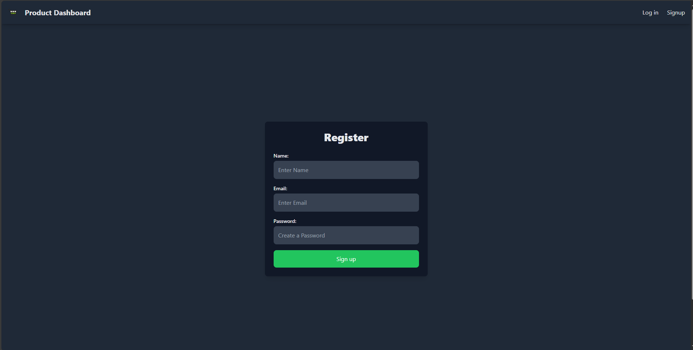

# **E-Commerce Dashboard using MERN Stack**

An Simple **E-Commerce Dashboard** that allows users to manage their accounts and products. From creating an account to adding product details such as price, company, and category, this dashboard covers it all.

---

## **Features**

✨ **Full-Stack Functionality** built using the MERN stack:

- **Frontend:** React
- **Backend:** Express
- **Database:** MongoDB Atlas

### **Key Capabilities**

- **User Authentication:**

  - Signup and Login functionality to secure user access.

- **Product Management:**

  - Add, View, Update, and Delete products with ease.

- **Profile Picture Management:**

  - Upload, Update, or Delete profile pictures for a personalized experience.

---

## **Tech Stack**

| **Technology**    | **Description**                             |
| ----------------- | ------------------------------------------- |
| **React**         | For building a dynamic and responsive UI.   |
| **Express**       | Lightweight server-side framework.          |
| **MongoDB Atlas** | Cloud-based NoSQL database. |

---

## **Application Screenshots**

This section provides an overview of the application's interface through screenshots.

### Screenshots

1. **Login Page**  
   

2. **Register Page**  
   

3. **Products Page**  
   

4. **Add Product Page**  
   

5. **Profile Page**  
   

6. **Profile Update Page**  
   
